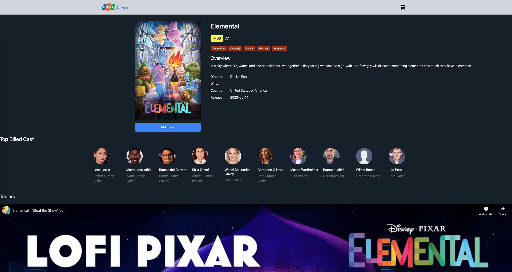
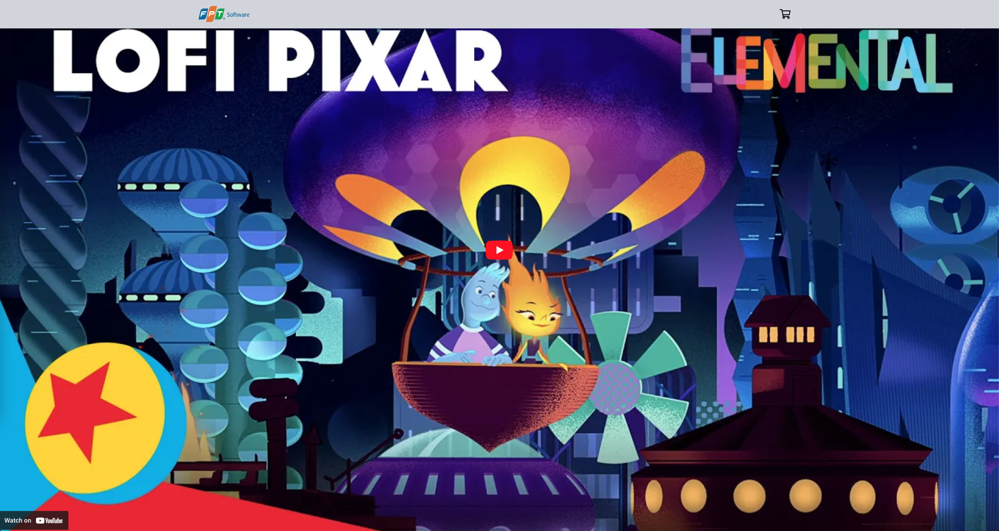
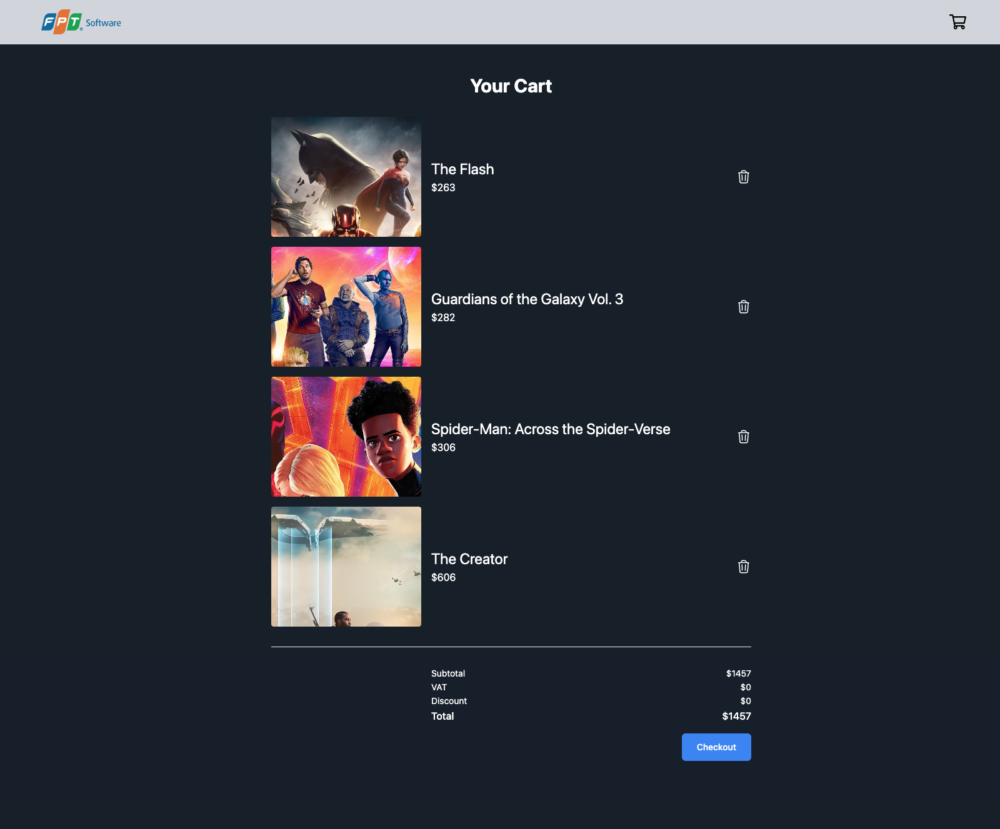

# Guideline Setup project

We need to 4 steps to start my project, take a breath and relax...

1. Install `Nodejs` environment via [download Nodejs](https://nodejs.org/en)

2. Install `pnpm` package by command below:

```sh
npm i -g pnpm
```

3. Pull package modules essentially:

```sh
pnpm install
```

4. Finally, run project...

```sh
pnpm dev
```

---

### Now, take a tea break ☕️ and enjoy our application via [Movie App: http://localhost:5173](http://localhost:5173)

-   Capture 1: **Home page** - show all Trending & Featured movies
    

-   Capture 2: **Movie genres** - list all movies by Genres (Action, Animation, Crime...)
    

-   Capture 3: **Movie details** - detail for current movie, include overview, ratings, actors / actress, director, writer, country, release date and youtube trailers video...
    
    

-   Capture 4: **Cart** - checkout for these movies was added into cart.
    
