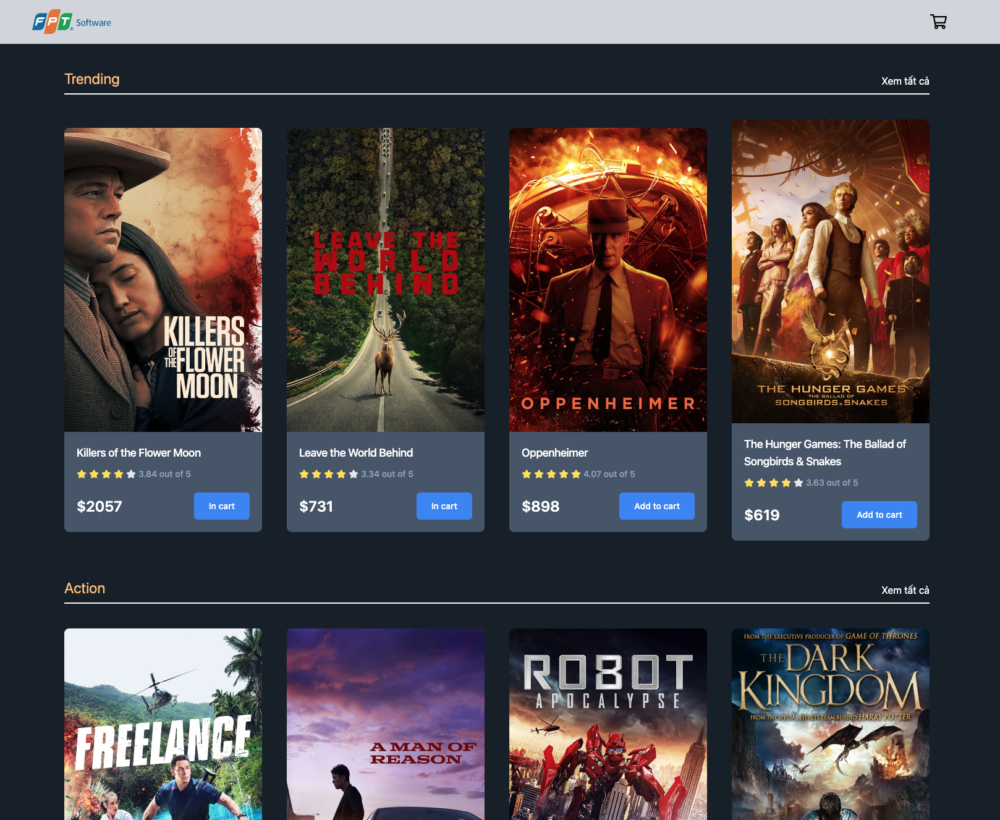
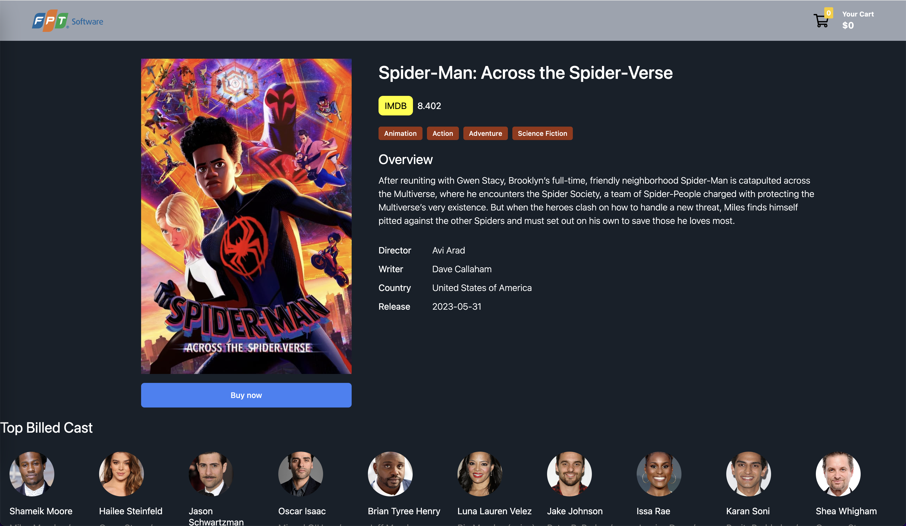

# Guideline Setup project

1. Install Nodejs environment via [Nodejs](https://nodejs.org/en)

2. Install `pnpm` package by command below:

```sh
npm i -g pnpm
```

3. Install package modules essentially:

```sh
pnpm install
```

4. Now, take a tea break ☕️ and enjoy our application via [Movie App: http://localhost:5173](http://localhost:5173)

-   Capture 1: **Home page**
    

-   Capture 2: **Movie genres**
    

-   Capture 3: **Movie details**
    
